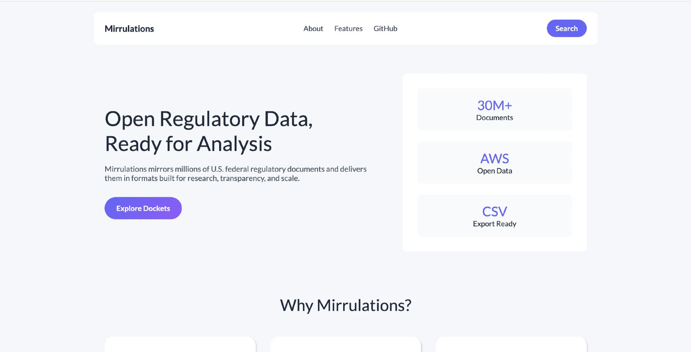

 

  

---

## 🚀 About Mirrulations

Mirrulations mirrors **millions of U.S. federal regulatory documents** and delivers them in formats built for **research, transparency, and large-scale analysis**.

### 📊 Project Highlights
- 📂 **30M+ Regulatory Documents**
- ☁️ **Hosted on AWS Open Data**
- 📄 **CSV Export Ready**
- 🔎 Built for search, analysis & research pipelines

---

## ✨ Core Features

| ⚡ Feature | 🚀 Description |
|-----------|----------------|
| Massive Scale | Nearly 30 million regulatory files mirrored from regulations.gov |
| Research Ready | Structured datasets ready for NLP & analytics |
| Open & Accessible | Public access via AWS Open Data |
| Developer Friendly | APIs, exports, and searchable datasets |

---

## 🛠 Tech Stack

---

## 🌐 Explore the Project

- 🔗 **Landing Page:** https://mirrulations.github.io/mirrulations-landing-page/
- 💻 **GitHub Organization:** https://github.com/mirrulations
- ☁️ **AWS Open Data:** https://registry.opendata.aws/

---

## Mission

Mirrulations is an open-source initiative focused on:

- Government transparency
- Open research infrastructure
- Accessible regulatory data
- Large-scale public datasets

---

**Credits:** [Mirrulations](https://github.com/mirrulations)
